# SƠ ĐỒ PIPELINE - CÔNG CỤ THU THẬP DỮ LIỆU ViSL

## SƠ ĐỒ TỔNG QUAN (Mermaid)

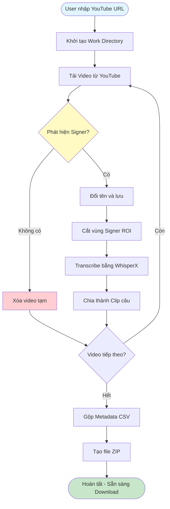

---

## SƠ ĐỒ CHI TIẾT TỪNG BƯỚC

### BƯỚC 1: DOWNLOAD & SIGNER DETECTION

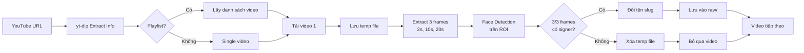

---

### BƯỚC 2: CROP SIGNER

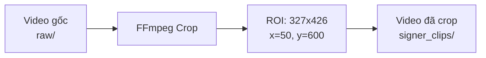

---

### BƯỚC 3: TRANSCRIBE

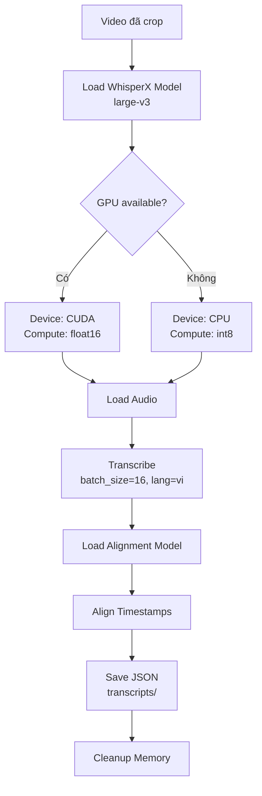

---

### BƯỚC 4: SPLIT CLIPS

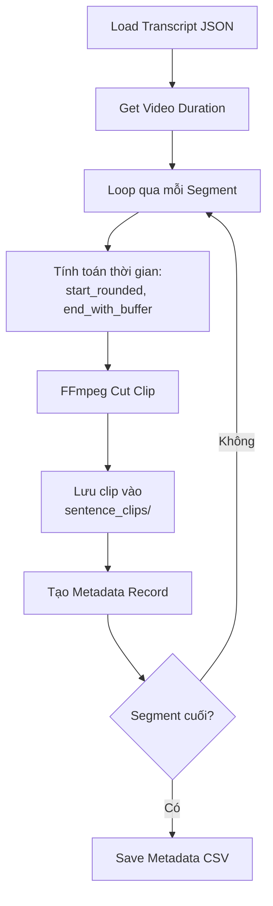

---

### BƯỚC 5: CREATE ZIP

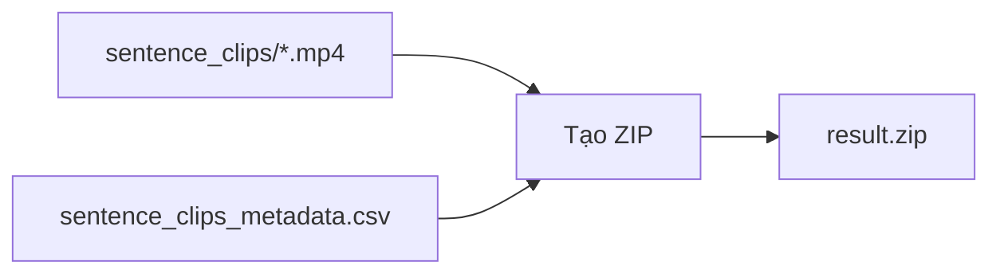

---

## SƠ ĐỒ XỬ LÝ NHIỀU VIDEO

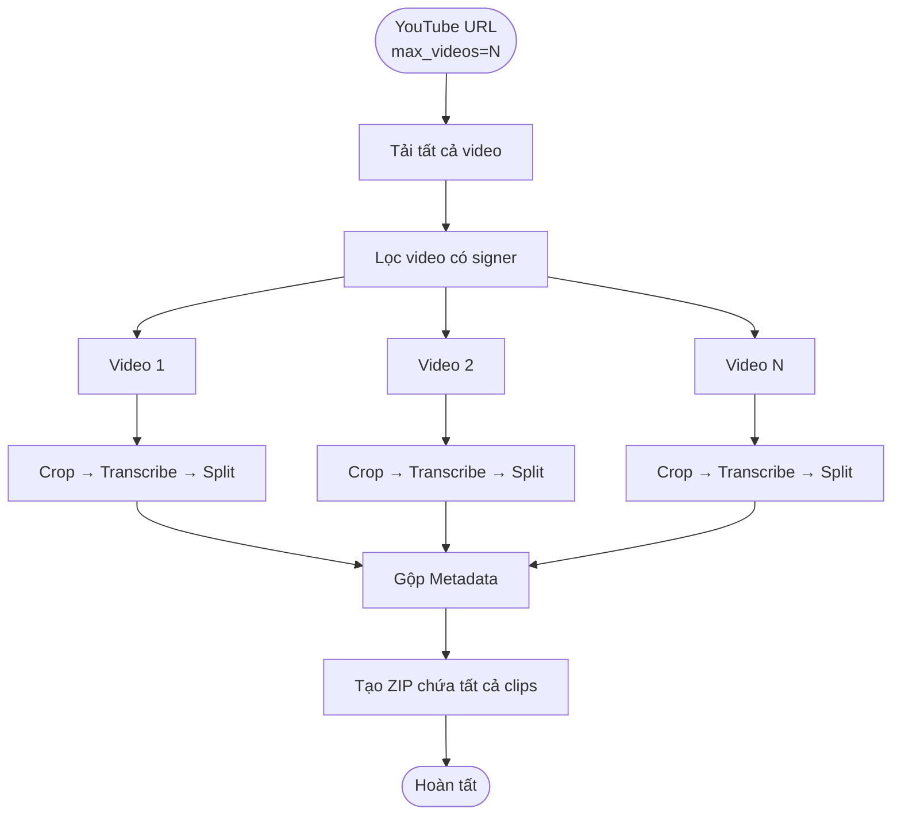

---

## SƠ ĐỒ PROGRESS TRACKING

```mermaid
gantt
    title Pipeline Progress Timeline
    dateFormat X
    axisFormat %s
    
    section Init
    Khởi tạo Work Dir    :0, 5
    
    section Download
    Extract Info         :5, 3
    Download Videos      :8, 4
    Signer Detection     :12, 3
    
    section Process
    Crop Signer          :15, 20
    Transcribe           :35, 30
    Split Clips          :65, 20
    
    section Finalize
    Save Metadata        :85, 5
    Create ZIP           :90, 5
    Complete             :95, 5
```

---

## SƠ ĐỒ XỬ LÝ LỖI

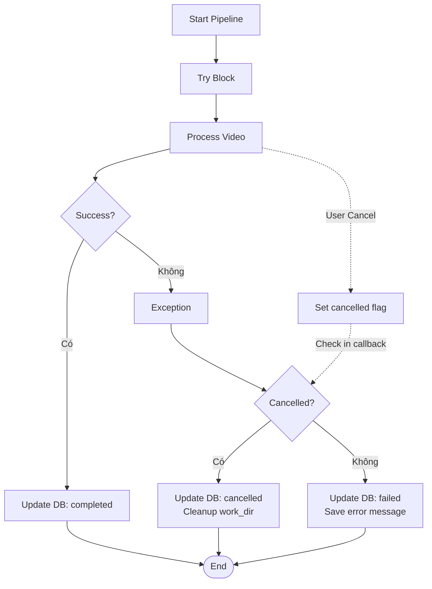

---

## SƠ ĐỒ CẤU TRÚC DỮ LIỆU

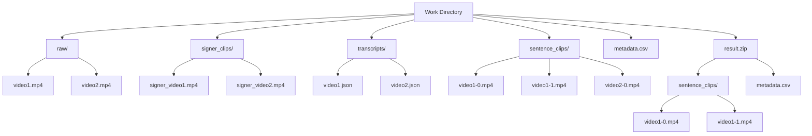

---

## SƠ ĐỒ API FLOW

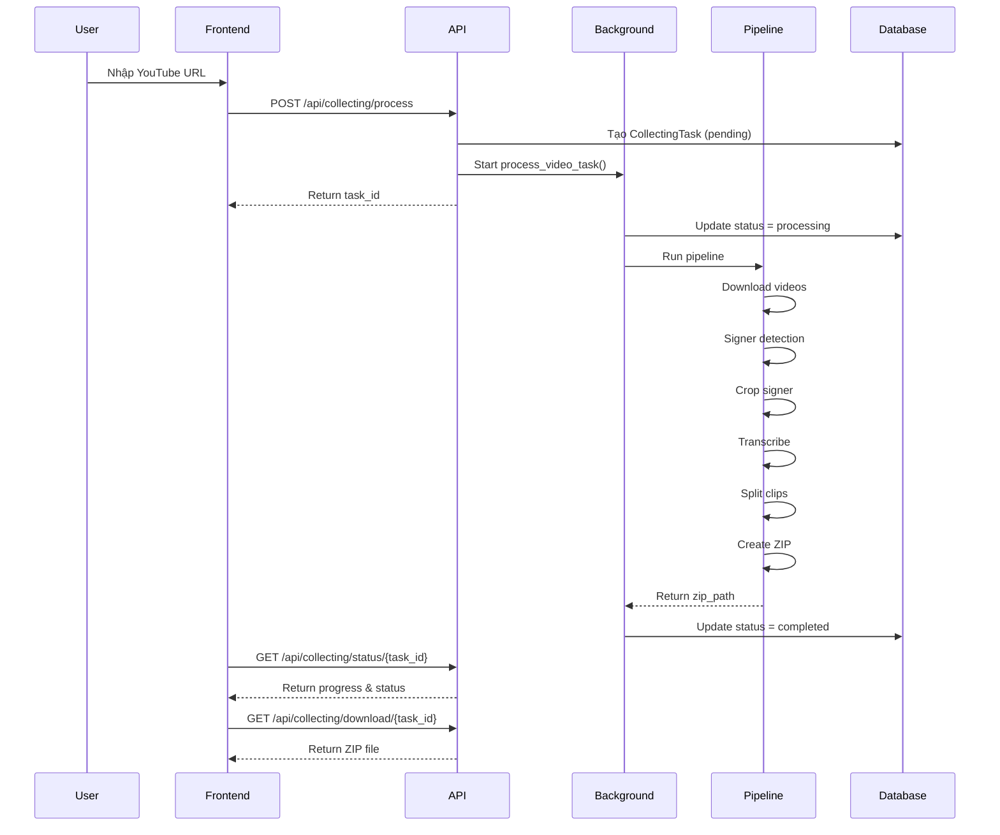

---

## SƠ ĐỒ SIGNER DETECTION CHI TIẾT

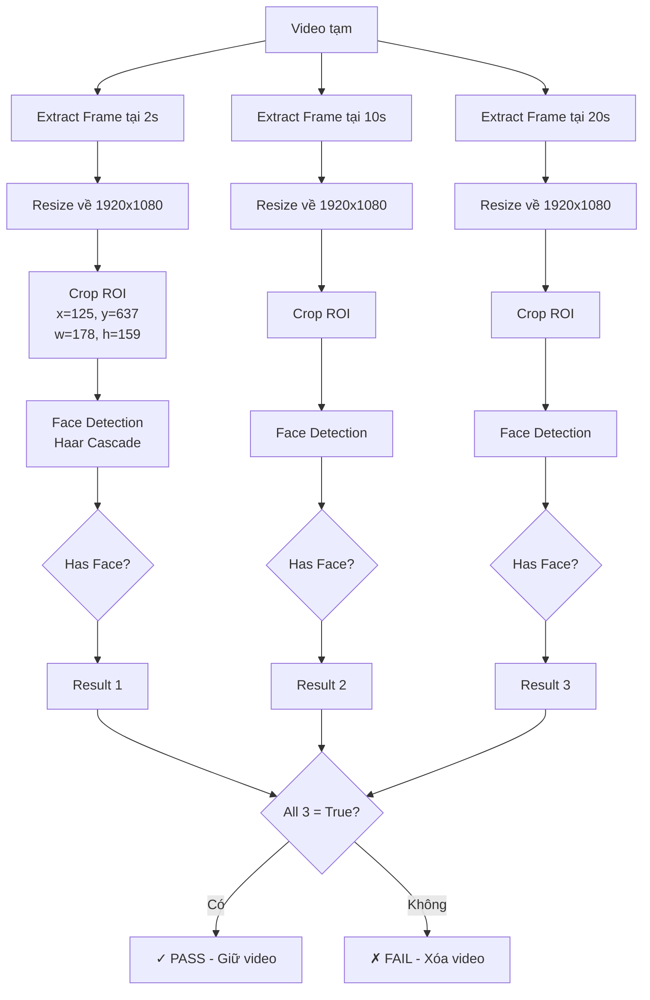

---

## GHI CHÚ VẼ DIAGRAM

### Màu sắc đề xuất:
- **Xanh dương nhạt**: Bắt đầu (Start)
- **Xanh lá**: Hoàn tất (Complete/Success)
- **Vàng**: Kiểm tra điều kiện (Decision)
- **Đỏ**: Lỗi/Xóa (Error/Delete)
- **Xám**: Xử lý trung gian (Process)

### Ký hiệu:
- Hình thoi: Decision/Check
- Hình chữ nhật: Process/Action
- Hình tròn: Start/End
- Mũi tên đứt nét: Callback/Event

### Layout:
- **Top to Bottom**: Flow chính
- **Left to Right**: Parallel processing
- **Sequence Diagram**: API interactions

